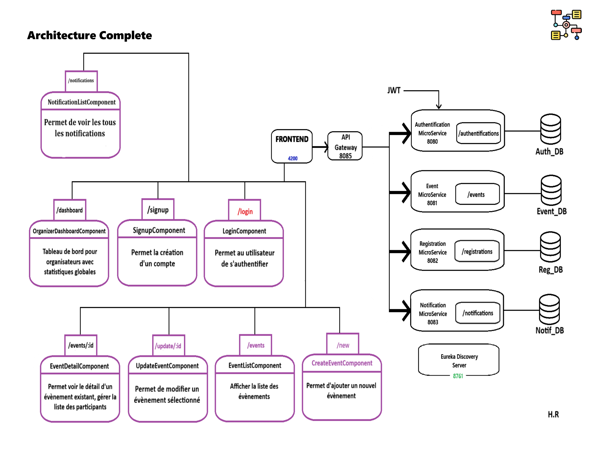
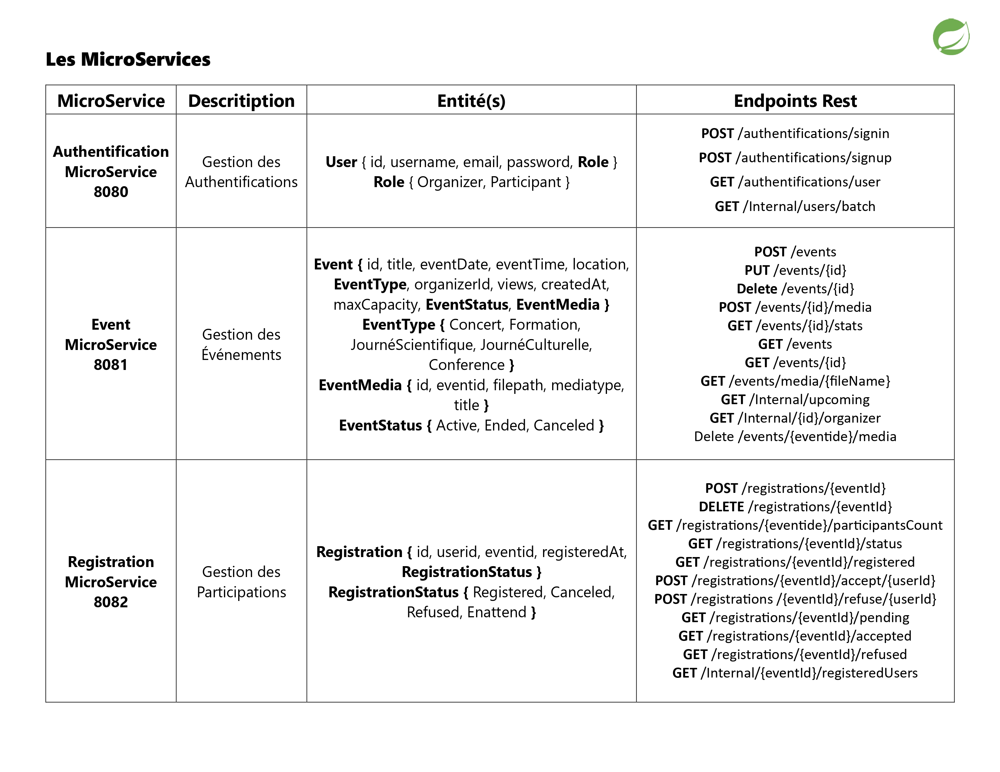
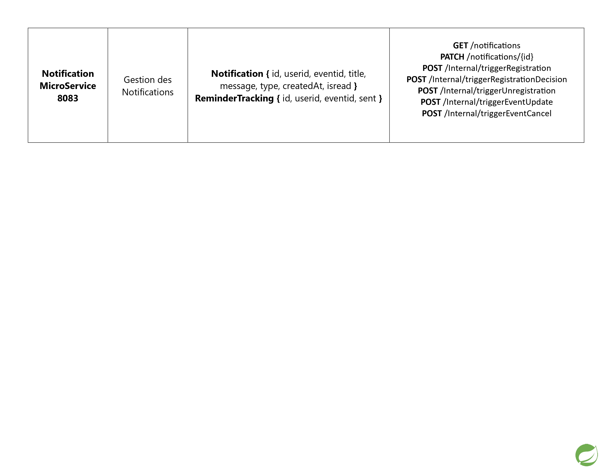
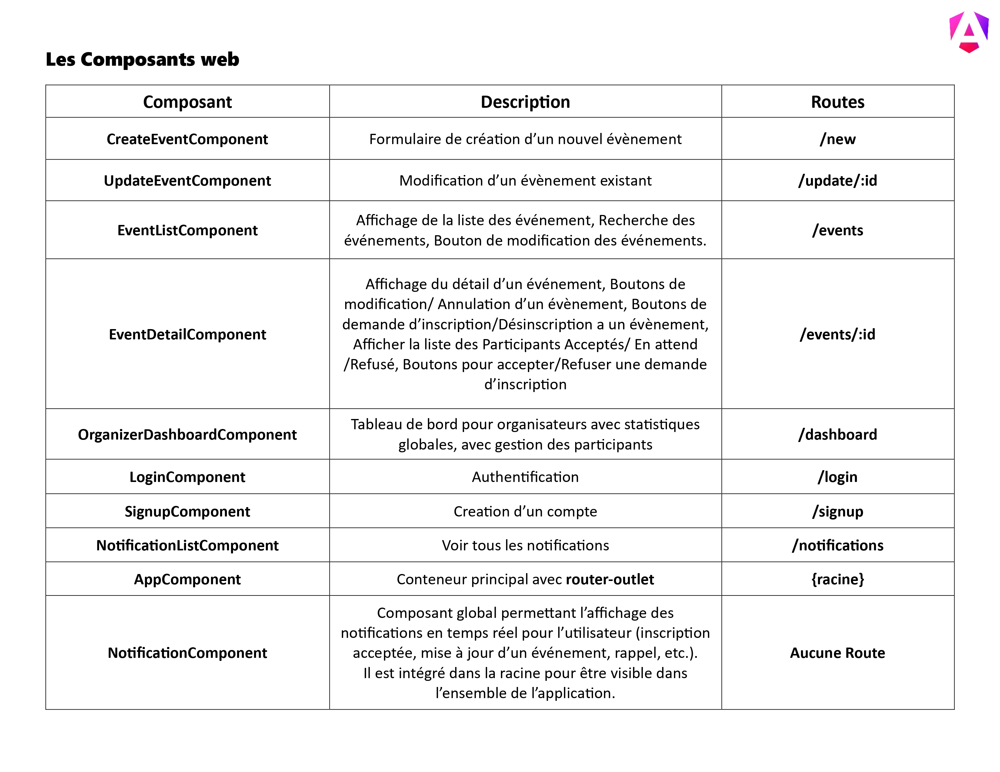
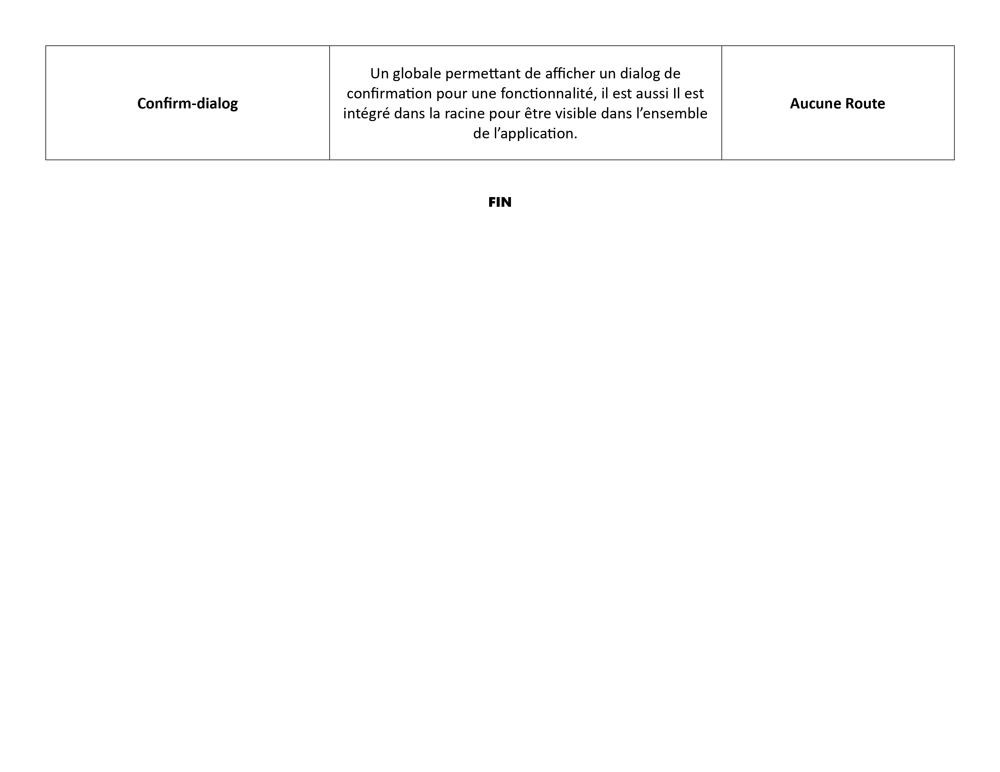

# Event Management Web Application

## Overview
This project is a full-stack web application for managing and organizing various events such as conferences, trainings, concerts, scientific days, and cultural events. It was developed as part of the M2 ISII - Ingénierie Web module for the 2025/2026 academic year. The application supports two main user roles: Organizers (who create and manage events) and Participants (who browse, register, and receive updates on events).
The backend is built using a microservices architecture with Spring Boot, ensuring scalability and modularity. The frontend is developed in Angular, providing a modern and interactive user interface. Security is handled via JWT (JSON Web Token) for authentication and authorization.
Key features include event creation with media uploads, participant management, real-time notifications, and dashboards for statistics.

## Features
•For Organizers: 

User authentication (signup, signin) with role (Organizer). 
Create, update, delete, and manage events (including adding images, videos, or documents like posters and programs). 
Manage participant lists and statuses (e.g., accept/refuse registrations). 
View global statistics on organized events (e.g., views, registrations). 
Send automatic notifications for confirmations, updates, cancellations, and reminders. 

•For Participants: 

User authentication (signup, signin) with role (Participant). 
Browse and search events by criteria (keywords, location, date, etc.). 
Register or unregister for events. 
Receive notifications for registration status, event updates, or reminders. 

## Architecture
The application follows a microservices-based architecture with an API Gateway for routing requests. Communication between services is handled via REST APIs, and service discovery is managed by Eureka Server.

## Technologies Used

•Backend: Java, Spring Boot, Spring Cloud (Eureka, Gateway), JWT for security, REST APIs. 
•Frontend: Angular, TypeScript, HTML/CSS. 
•Databases: MySQL (one per microservice). 

## Installation and Setup
### Prerequisites

•Java JDK 17+ 
•Node.js and npm (for Angular) 
•MySQL (create databases for each microservice) 
•Git 

### Steps
•Backend Setup: 
Navigate to each microservice directory (e.g., authentication-service, event-service, etc.). 
Update application.properties or application.yml with your database credentials. 
Build and run each service: 
->mvn clean install 
->mvn spring-boot:run 
Start Eureka Server first (port 8761), then other services. 
API Gateway will run on port 8085. 

•Frontend Setup:
Navigate to the Angular frontend directory. 
Install dependencies: 
->npm install 
Run the app:
->ng serve 
The frontend will be available at http://localhost:4200. 

•Database Setup: 
Create databases: auth_db, event_db, reg_db, notif_db. 

## Author
Rouibah Hanine (2025)

## License
License MIT License – feel free to use, modify, and share!